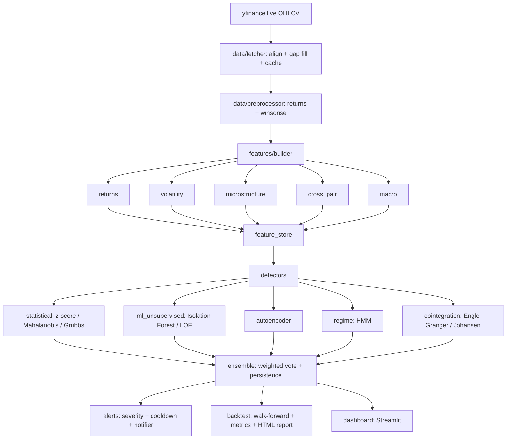

# FX Anomaly Detector

Production-grade FX anomaly detection system combining statistical methods,
machine learning, and regime analysis for G10 currency pairs.

## What it does

The system ingests live daily OHLCV data for ten G10 currency pairs from Yahoo
Finance, engineers a broad set of economically motivated features, and runs
seven independent anomaly detectors whose outputs are combined into a single
ensemble score. Confirmed anomalies generate severity-graded alerts. A
walk-forward backtester with purging evaluates a defensive trading rule on the
detector signals, and a Streamlit dashboard provides live monitoring, per-pair
deep dives, regime analysis, and backtest results.

It is intended for FX risk monitoring and research, not as investment advice.

## Architecture



## Quick start

```bash
pip install -r requirements.txt

# Live detection on all pairs (fetches live data from yfinance)
python scripts/run_detector.py --mode live --pairs all

# Walk-forward backtest with an HTML report
python scripts/run_detector.py --mode backtest --start 2018-01-01 --end 2024-12-31

# Launch the dashboard
streamlit run src/dashboard/app.py
```

All market data is fetched live from Yahoo Finance via `yfinance`; nothing is
hard coded or synthesised in the production path. Synthetic data is used only in
the test suite.

## Features and their economic rationale

- Return distribution (returns.py): rolling mean, standard deviation, skewness,
  excess kurtosis, z-score, Jarque-Bera normality p-value, and a from-scratch
  Hurst exponent (rescaled-range method) to distinguish mean-reverting,
  random-walk, and trending behaviour.
- Volatility (volatility.py): close-to-close, Parkinson (high-low), and
  Garman-Klass (OHLC) estimators; their ratios; volatility z-score, term
  structure, and volatility-of-volatility; plus GARCH(1,1) conditional
  volatility and standardised residuals.
- Microstructure (microstructure.py): Corwin-Schultz high-low spread proxy,
  Amihud illiquidity, a Kyle-lambda price-impact proxy, and abnormal-range
  z-scores. Daily range stands in for volume, which is unreliable for FX.
- Cross-pair (cross_pair.py): triangular arbitrage residuals, rolling
  correlation against the cross-section, first-principal-component variance
  share (risk-on/risk-off concentration), cross-pair betas, and Engle-Granger
  cointegration residuals.
- Macro (macro.py): VIX level and z-score (global risk aversion), dollar-index
  returns (broad USD strength), gold-versus-dollar correlation, and a carry
  proxy. Covered-interest-parity deviation is flagged as missing where forward
  data is unavailable rather than fabricated.

## Detectors and references

- Statistical (statistical.py): rolling z-score with a Bonferroni-corrected
  flag threshold, Mahalanobis distance with Ledoit-Wolf shrinkage and a
  chi-squared cutoff, and a Grubbs outlier test.
- Unsupervised ML (ml_unsupervised.py): Isolation Forest (Liu, Ting, Zhou 2008)
  and Local Outlier Factor, refit on a rolling schedule.
- Autoencoder (autoencoder.py): a dense reconstruction-error detector trained on
  an assumed-normal warm-up period. Degrades to a no-op if TensorFlow is absent.
- Regime (regime.py): a three-state Gaussian HMM (Hamilton 1989); the crisis
  state is the highest-volatility state and its posterior probability is the
  anomaly score.
- Cointegration (cointegration.py): Engle-Granger (1987) spread monitoring with
  an ADF cointegration check and a Johansen (1991) rank monitor.
- Ensemble (ensemble.py): weighted average of detector scores with renormalised
  weights when a detector is missing, a two-detector agreement rule, and a
  persistence filter.

Additional references: Parkinson (1980) and Garman-Klass (1980) for volatility
estimators; Corwin-Schultz (2012) for the spread proxy; Mandelbrot and Wallis
(1969) for the Hurst exponent; Bollerslev (1986) for GARCH; Kelly (1956) for
position sizing; De Prado (2018) for purged walk-forward validation.

## Configuration

All tunable constants live in `config/settings.py`: the pair list, rolling
window sizes, detector thresholds, ensemble weights, and backtest parameters.
Change them there rather than scattering magic numbers through the code.

## Risk and backtesting

`src/risk` provides parametric, historical, and Monte Carlo VaR/CVaR, drawdown
analysis, and capped half-Kelly position sizing. `src/backtest` runs a
walk-forward backtest with a purge gap between train and test windows, refitting
detectors per fold to prevent cross-fold leakage, and produces an HTML report
with equity, drawdown, monthly returns, rolling Sharpe, anomaly and regime
timelines, and a per-pair breakdown.

## Testing

```bash
pip install -r requirements-dev.txt
pytest tests/ -v --cov=src --cov-report=term-missing
```

Tests use deterministic, seeded synthetic data with injected anomalies (return
spikes and volatility jumps). The autoencoder path requires TensorFlow; without
it the detector is a no-op and the rest of the suite still runs.

## License

MIT. See `LICENSE`.
